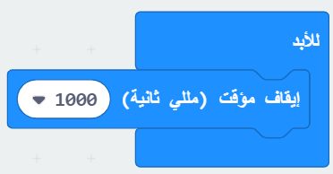
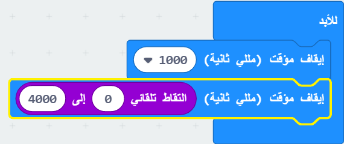
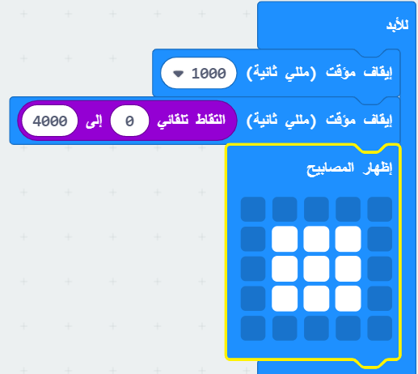
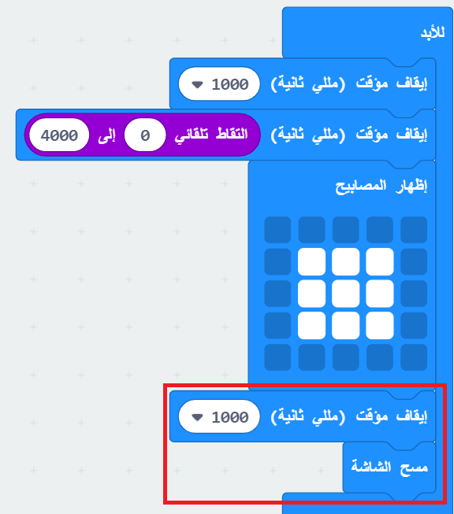

## انتظرها!

دعونا نبدأ بعرض صورة بعد فترة زمنية عشوائية.

+ اذهب إلى <a href="https://rpf.io/microbit-new" target="_blank">rpf.io/microbit-new</a> لبدء مشروع جديد في محرر MakeCode (PXT). سمي مشروعك الجديد 'ردة فعل'.

+ قبل عرض الصورة ، يجب أن تنتظر اللعبة لفترة عشوائية من الوقت.

اسحب كتلة `إيقاف مؤقت` إلى كتلة `للأبد` وقم بتغيير وقت الإيقاف المؤقت إلى 1000 مل:

+ أضف كتلة أخرى `إيقاف مؤقت` ثم قم بسحب كتلة `اختر عشوائي` إلى كتلة `إيقاف مؤقت` وتعيين قيمتها إلى 4000:

تذكر أن 1000mm هي 1 ثانية، لذلك سيكون هناك توقف لمدة ثانية واحدة على الأقل بحد أقصى 5 ثوان (1000 + 4000 م).

يمكنك تغيير الرقمين "1000" و "4000" لتغيير الحد الأدنى والحد الأقصى للإيقاف المؤقت إذا أردت.

+ بعد الانتظار، يجب أن تظهر لعبتك صورة حتى يعرف اللاعبين متى يضغطون على ازرارهم.

+ انقر فوق 'تشغيل' لاختبار مشروعك. يجب أن ترى صورتك تظهر بعد تأخير عشوائي.

+ أضف تعليمة برمجية في نهاية حلقة `إلى الأبد` لعرض صورتك لمدة ثانية واحدة ثم مسح العرض.

+ اختبر مشروعك. يجب أن ترى صورتك تظهر بشكل عشوائي ثم تختفي.