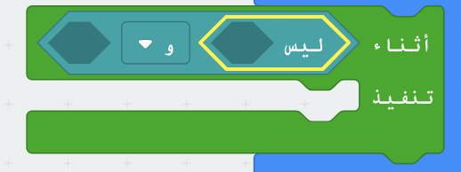

## في انتظار الفائز

دعونا نضيف تعليمة برمجية للانتظار حتى يتم الضغط على الزر.

+ بعد عرض الصورة ، ستحتاج إلى الانتظار حتى يضغط شخص ما على الزر الخاص به.

طريقة أخرى لقول هذا هو أنك ستحتاج إلى الانتظار طالما **لم يتم** الضغط على الزر A **و** B.

للقيام بذلك، أضف حلقة `أثناء` من قسم "حلقات". يجب إضافة حلقة `أثناء` مباشرة بعد الكتلة `رسم `.

+ اسحب كتلة `و` من 'منطق' إلى كتلة `ابدأ` الخاصة بك:

+ اسحب `ليس` من "منطق" إلى الجانب الأيسر من `و`:

+ اسحب كتلة `الزر A مضغوط` من 'الإدخال' وضعها بعد `ليس`:

+ كرر الخطوتين أعلاه لإضافة `ليس الزر B مضغوط` إلى الجانب `الايمن` من حلقة التكرار الخاصة بك.

+ يمكنك بعد ذلك إضافة مهلة قصيرة جدا (20 ملي ثانية)، بحيث تنتظر حلقة `ابدأ` طالما لم يتم الضغط على الزر.

+ اختبر مشروعك. يجب على لعبتك الآن عرض صورة ثم الانتظار طالما **لم يتم** الضغط على الأزرار A **و** B.