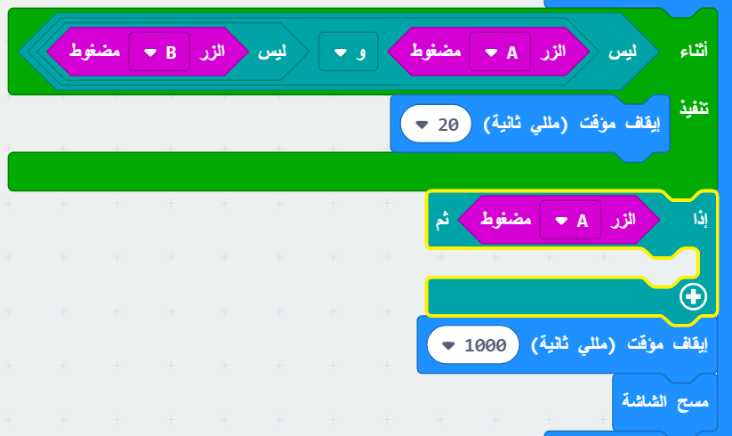
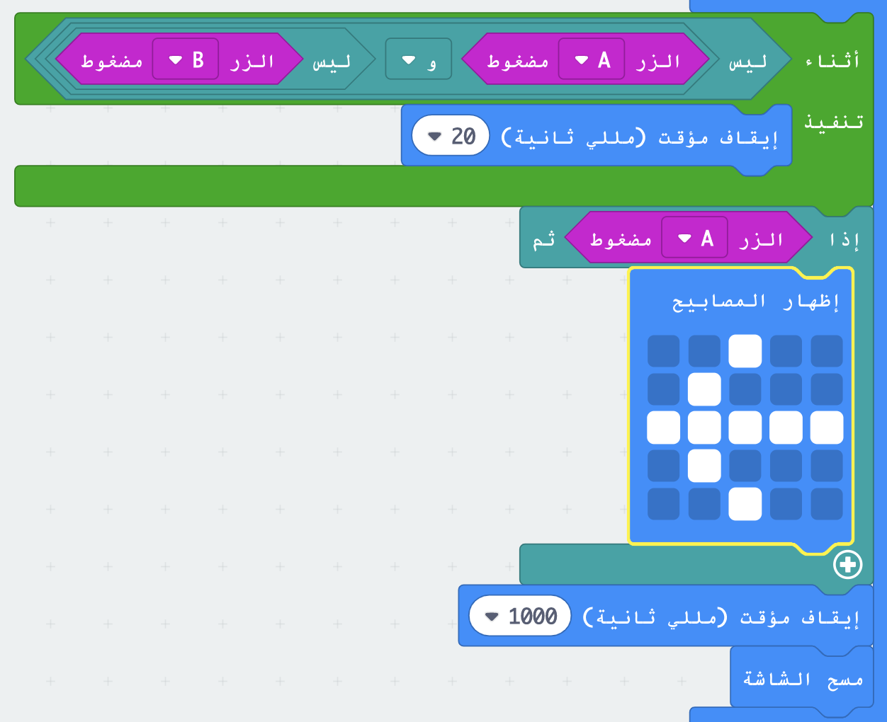
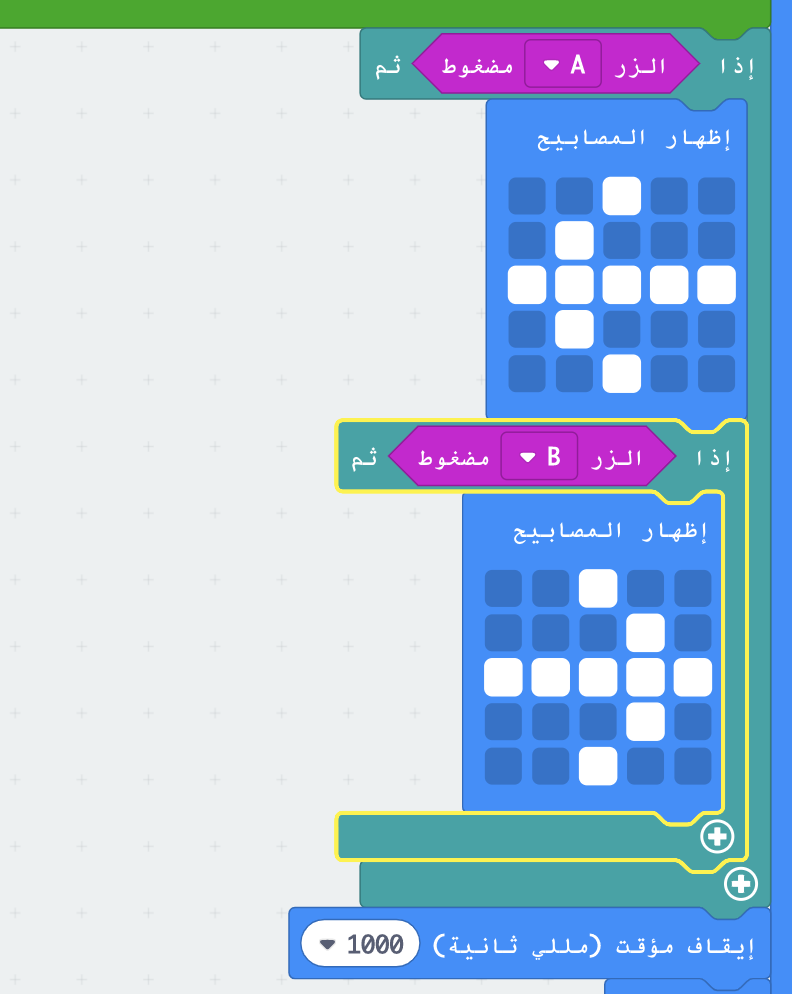

## من هو الأسرع؟

دعونا نعرف من قام بالضغط على الزر أولاً.

+ إذا تم الضغط على الزر A، نريد أن نشير إلى اللاعب A. للقيام بذلك، أضف كتلة `اذا` بعد حلقة `أثناء` ، واستبدل `اختبار` بـ `الزر A مضغوط `.

+ يمكنك بعد ذلك استخدام الكتلة ` إظهار المصابيح ` لعرض سهم يشير إلى اللاعب A.

+ يجب عليك أيضًا أن تفعل نفس الشيء بالنسبة للزر B.

