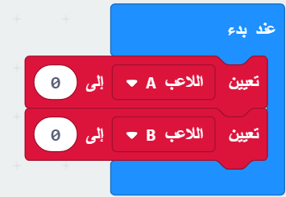

\--- challenge \---

## التحدي: الاحتفاظ بالنتيجة

هل يمكنك استخدام متغيرين يسميان `اللاعب أ` و `اللاعب ب` لتتبع نقاط كل لاعب؟

ستحتاج إلى تعيين كلا النتيجتين إلى 0 في بداية اللعبة عن طريق وضع التعليمات البرمجية داخل الكتلة البرمجية "عند بدء".

وأضف 1 إلى أي لاعب يفوز في كل جولة.

ستحتاج أيضًا إلى التفكير في طريقة لعرض النتيجة.

\--- /challenge \---