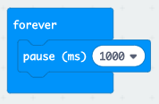
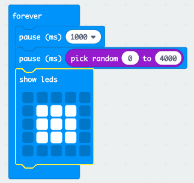

## Arhoswch amdani!

Gadewch i ni ddechrau trwy arddangos delwedd ar ôl cyfnod o amser a bennir ar hap.

+ Go to <a href="https://rpf.io/microbit-new" target="_blank">rpf.io/microbit-new</a> to start a new project in the MakeCode (PXT) editor. Galwch eich prosiect newydd yn 'Adweithio'.

+ Cyn arddangos delwedd, dylai'r gêm aros am gyfnod o amser a bennir ar hap.

Llusgwch floc `pause` (rhewi) i'r bloc `forever` (am byth) a newid yr amser rhewi i 1000 ms:

+ Ychwanegwch floc `pause` (rhewi) arall ac yna llusgo bloc `pick random` (dewis ar hap) i’r bloc `pause` (rhewi) a gosod ei werth i 4000:

Cofiwch fod 1000ms yn 1 eiliad, felly bydd saib o 1 eiliad neu fwy hyd at uchafswm o 5 eiliad (1000 + 4000 ms).

Gallwch newid y rhifau '1000' a '4000' i newid yr oedi isaf a’r oedi uchaf os hoffech.

+ Wedi aros, dylai eich gêm ddangos delwedd fel bod chwaraewyr yn gwybod pryd i wasgu eu botwm.

+ Cliciwch ar 'run' (rhedeg) i brofi eich prosiect. Dylech weld eich delwedd yn ymddangos ar ôl ychydig o oedi.

+ Ychwanegwch y cod ar ddiwedd y ddolen `forever` (am byth) i ddangos eich delwed am 1 eiliad ac yna clirio’r sgrin.

+ Profi eich prosiect. Dylech weld eich delwedd yn ymddangos ar hap ac yna’n diflannu.