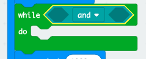

## Aros am enillydd

Beth am ychwanegu cod i aros nes bydd botwm wedi ei wasgu.

+ Wedi arddangos delwedd, bydd angen i chi aros nes bydd rhywun arall yn gwasgu ei fotwm.

Ffordd arall o ddweud hyn yw y bydd angen i chi aros tra bydd botwm A **a** botwm B **heb** eu gwasgu.

I wneud hyn, ychwanegwch ddolen `while` (tra) o’r adran 'Control' (Rheoli). Dylai’r ddolen `while` (tra) gael ei hychwanegu ychydig wedi’r bloc `draw` (tynnu).

+ Llusgwch floc `and` (a) o 'Logic' i’ch bloc `while` (tra):

+ Llusgwch `not` (nid) o 'Logic' i ochr chwith yr `and` (ac):

+ Llusgwch floc `button A is pressed` (gwasgwyd botwm A) o 'Input' (Mewnbwn) wedi’r `not` (nid):

+ Ailadroddwch y 2 gam uchod i ychwanegu `not button B is pressed` (nid botwm B wedi ei wasgu) i'r ochr `right` (dde) o’ch dolen tra.

+ Yna gallwch ychwanegu oedi byr iawn (20ms), fel bod eich dolen `while` (tra) yn aros cyn belled nad oes botwm wedi ei wasgu.

+ Profi eich prosiect. Dylai eich gêm nawr arddangos delwedd ac yna aros tra bydd botymau A **a** B **heb** eu gwasgu.