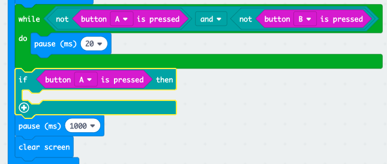

## Who is the faster?

Gadewch i ni weld pwy wasgodd ei fotwm gyntaf.

+ Os gwasgwyd botwm A, rydym angen pwyntio at chwaraewr A. I wneud hyn, ychwanegwch floc `if` (os) ar ôl eich dolen `while` (tra), a newid `test` (prawf) am `button A is pressed` (botwm A wedi ei wasgu).

+ Yna gallwch ddefnyddio’r bloc `show leds` (dangos leds) i ddangos saeth yn pwyntio at chwaraewr A.

+ Dylech hefyd wneud yr un peth ar gyfer botwm B.

