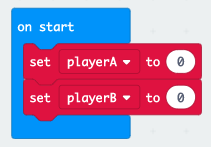

--- challenge ---

## Her: Cadw sgôr

Allwch chi ddefnyddio dau newidyn o’r enw `chwaraewrA` a `chwaraewrB` i ddilyn sgôr pob chwaraewr?

Bydd angen i chi osod y ddwy sgôr i 0 ar ddechrau'r gêm trwy osod y cod yn y bloc ‘ar gychwyn’.

Ac ychwanegu 1 i ba chwaraewr bynnag sy'n ennill pob rownd.

Byddwch hefyd angen meddwl am ffordd i arddangos y sgôr.

--- /challenge ---