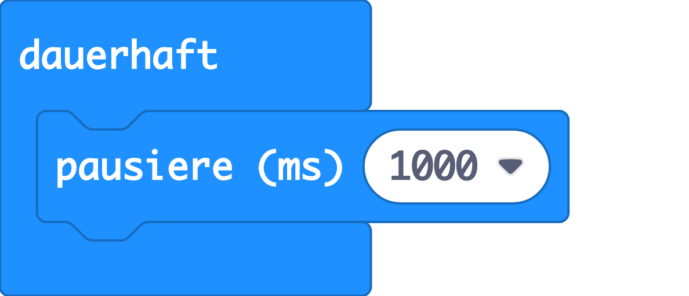
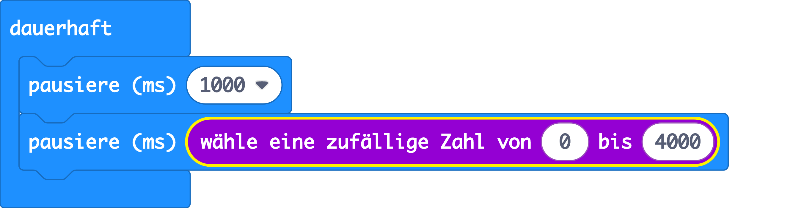
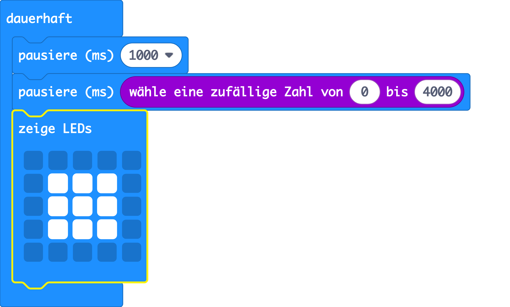
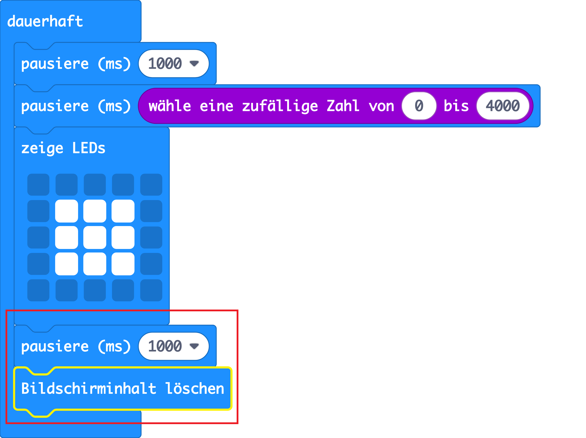

## Warte darauf!

Lass uns mit der Anzeige eines Bildes nach einer zufälligen Zeitspanne beginnen.

+ Rufe <a href="https://rpf.io/microbit-new" target="_blank">rpf.io/microbit-new</a> auf, um ein neues Projekt im MakeCode (PXT) Editor zu starten. Nenne dein neues Projekt "Reaktion".

+ Vor dem Anzeigen eines Bildes sollte das Spiel eine zufällige Zeit warten.

Ziehe einen `Pause` Block in den `dauerhaft` Block und ändere die Pausenzeit auf 1000 ms:

+ Füge einen weiteren `Pause-` Block hinzu und ziehe dann den Block `wähle eine zufällige Zahl-` auf den `Pause-` Block und setze seinen Wert auf 4000:

Denk daran, dass 1000 ms 1 Sekunde sind, sodass eine Pause von mindestens 1 Sekunde bis maximal 5 Sekunden (1000 + 4000 ms) entsteht.

Wenn du willst, kannst die Nummern '1000' und '4000' ändern, um die minimale und maximale Pause zu ändern.

+ Nach dem Warten sollte in deinem Spiel ein Bild angezeigt werden, damit die Spieler wissen, wann sie ihren Knopf drücken müssen.

+ Klicke auf "Ausführen", um dein Projekt zu testen. Du solltest dein Bild nach einer zufälligen Wartezeit sehen.

+ Füge am Ende der `dauerhaft` Schleife einen Code hinzu, um dein Bild 1 Sekunde lang anzuzeigen, und lösche dann die Anzeige.

+ Teste dein Projekt. Du solltest sehen, dass dein Bild zufällig erscheint und dann verschwindet.