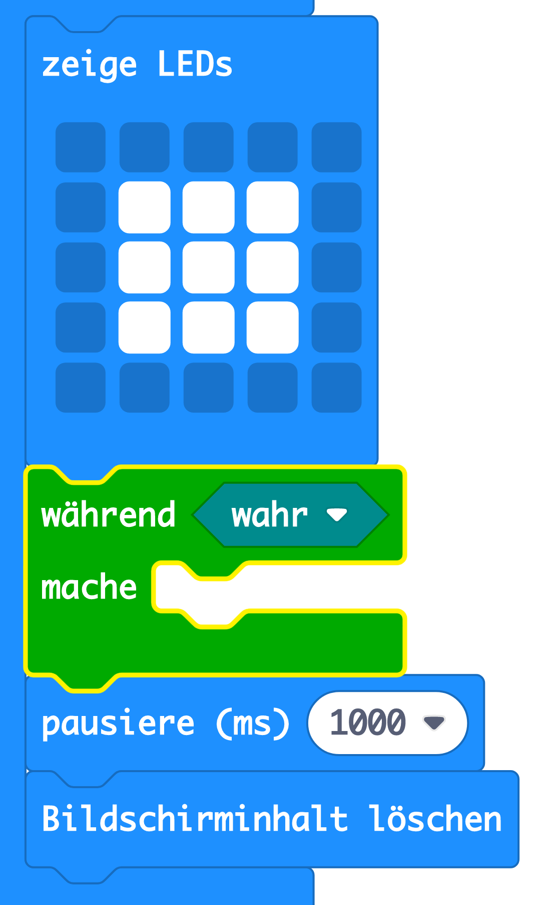
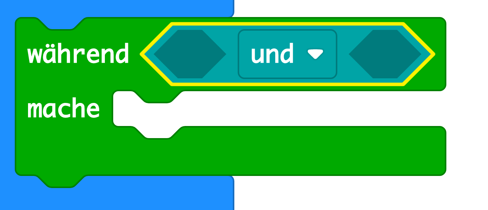
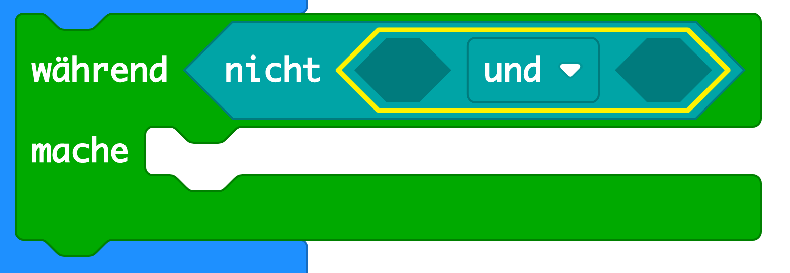
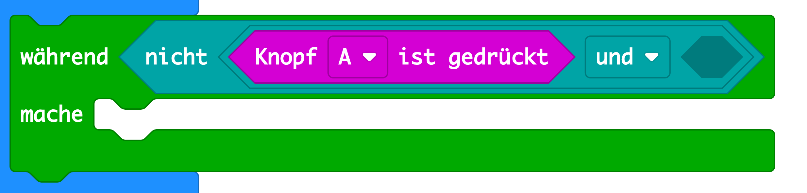
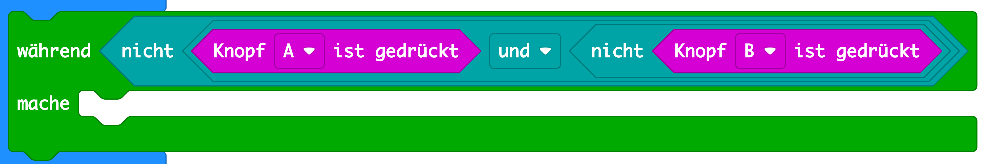
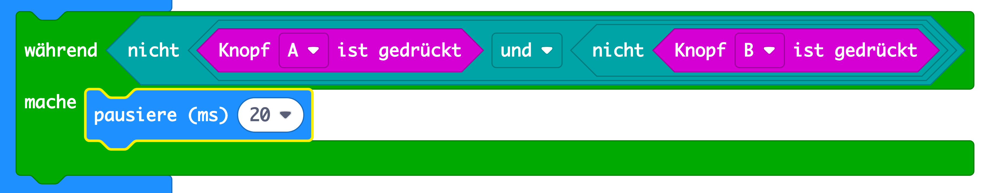

## Warte auf einen Gewinner

Fügen wir einen Code hinzu, um zu warten, bis ein Knopf gedrückt wird.

+ Nach dem Anzeigen eines Bildes musst du warten, bis jemand seinen Knopf drückt.

Eine andere Möglichkeit, dies zu sagen, besteht darin, dass du so lange warten musst, bis Knopf A **und** Knopf B **nicht** gedrückt wurden.

To do this, add a `while` loop from the 'Control' section. Die `während` Schleife sollte direkt nach dem `Draw` Block hinzugefügt werden.

+ Ziehe einen `und` Block aus 'Logik' in deinen `während` Block:

+ Ziehe ein `nicht` aus 'Logik' auf die linke Seite von `und`:

+ Ziehe den Block `wenn Knopf A ist gedrückt` von 'Eingabe' unter `nein`: 

+ Wiederhole die beiden obigen Schritte, um `nicht Knopf B ist gedrückt` in die `rechte` Seite deiner während-Schleife hinzuzufügen.

+ Du kannst dann eine sehr kurze Wartezeit (20 ms) hinzufügen, sodass deine `während` Schleife wartet, solange kein Knopf gedrückt wurde.

+ Teste dein Projekt. Dein Spiel sollte jetzt ein Bild anzeigen und dann warten, solange die Knöpfe A **und** B **nicht** gedrückt wurden.