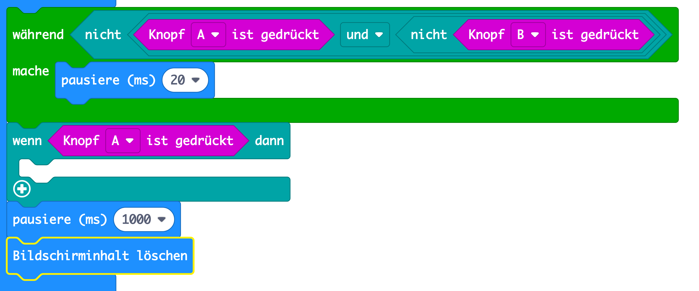
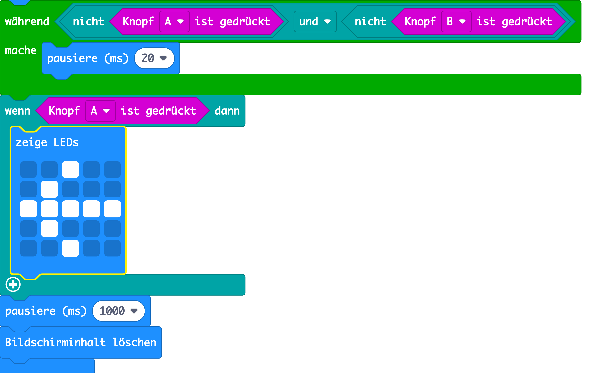
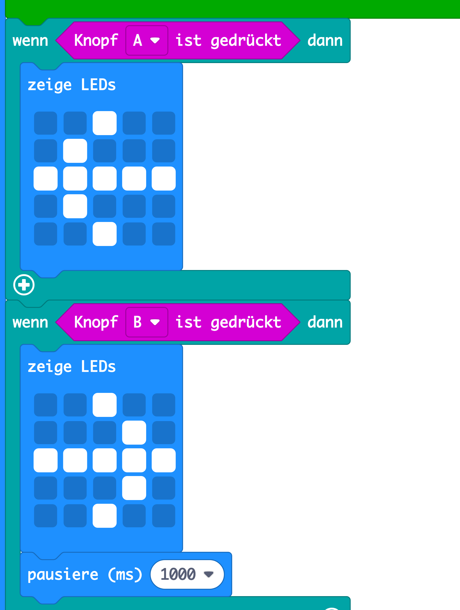

## Wer ist der Schnellste?

Lass uns herausfinden, wer zuerst den Knopf gedrückt hat.

+ Wenn Knopf A gedrückt wurde, möchten wir auf Spieler A zeigen. Füge dazu einen `wenn` Block nach deiner `während` Schleife hinzu und ersetze `Test` mit `Knopf A ist gedrückt`.

+ Du kannst dann den Block `zeige LEDs` nutzen, um einen Pfeil anzuzeigen, der auf Spieler A zeigt.

+ Du solltest das Gleiche auch für Knopf B tun.

