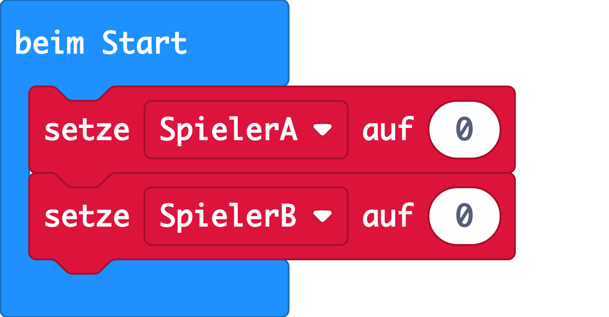

--- challenge ---

## Herausforderung: Punktzahl halten

Kannst du zwei Variablen mit den Namen `Spieler A` und `Spieler B` verwenden, um die Punktzahl jedes Spielers zu verfolgen?

Du musst beide Punkte zu Beginn des Spiels auf 0 setzen, indem du den Code in den Block "Beim Start" einfügst.

Und füge 1 zu dem Spieler hinzu, der jede Runde gewinnt.

Du solltest dir auch überlegen, wie du die Punktezahl anzeigen möchtest.

--- /challenge ---

***
Dieses Projekt wurde von freiwilligen Helfern übersetzt:

Katharina Lindenblatt

Nicole Rotarius

Dank freiwilliger Helfer können wir Menschen auf der ganzen Welt die Möglichkeit geben, in ihrer eigenen Sprache zu lernen. Du kannst uns helfen, mehr Menschen zu erreichen, indem Du dich freiwillig zum Übersetzen meldest - weitere Informationen unter [rpf.io/translate](https://rpf.io/translate).