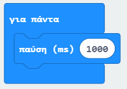
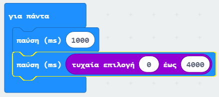
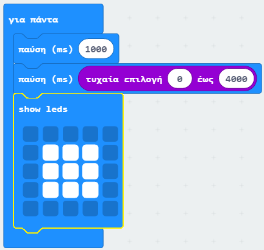
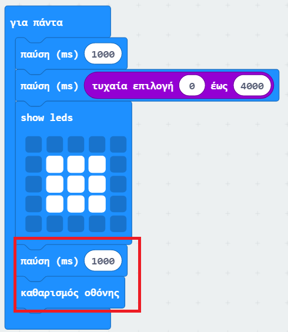

## Περίμενε μέχρι να εμφανιστεί!

Ας αρχίσουμε εμφανίζοντας την εικόνα μετά από ένα τυχαίο χρονικό διάστημα.

+ Πήγαινε στο <a href="https://rpf.io/microbit-new" target="_blank">rpf.io/microbit-new</a> για να ξεκινήσεις ένα νέο έργο στον επεξεργαστή MakeCode (PXT). Ονόμασε το νέο σου έργο 'Reaction'.

+ Πριν από την εμφάνιση μιας εικόνας, το παιχνίδι θα πρέπει να περιμένει ένα τυχαίο χρονικό διάστημα.

Σύρε ένα μπλοκ `παύση` μέσα στο μπλοκ `για πάντα` και άλλαξε τον χρόνο αναμονής σε 1000 ms:

+ Πρόσθεσε ένα ακόμα μπλοκ `παύση` και, στη συνέχεια, σύρε ένα μπλοκ `τυχαία επιλογή` μέσα στο μπλοκ `παύση` και θέσε την τιμή του σε 4000:

Θυμήσου ότι 1000ms είναι ίσα με 1 δευτερόλεπτο, οπότε θα υπάρξει μια παύση τουλάχιστον 1 δευτερολέπτου μέχρι και το πολύ 5 δευτερόλεπτα (1000 + 4000 ms).

Εάν θέλεις μπορείς να αλλάξεις τους αριθμούς '1000' και '4000' για να προσαρμόσεις τον ελάχιστο και τον μέγιστο χρόνο αναμονής.

+ Αφού περάσει ο χρόνος αναμονής, το παιχνίδι σου θα πρέπει να εμφανίσει μία εικόνα ώστε οι παίκτες να ξέρουν πότε να πατήσουν το κουμπί τους.

+ Πάτησε 'εκτέλεση' για να δοκιμάσεις το έργο. Θα πρέπει να δεις την εικόνα να εμφανίζεται μετά από ένα τυχαίο χρονικό διάστημα αναμονής.

+ Πρόσθεσε κώδικα στο τέλος της επανάληψης `για πάντα` ώστε να εμφανίζεται η εικόνα για 1 δευτερόλεπτο και, στη συνέχεια, να καθαρίζει η οθόνη.

+ Δοκίμασε το έργο σου. Θα πρέπει να δεις την εικόνα να εμφανίζεται τυχαία και μετά να εξαφανίζεται.