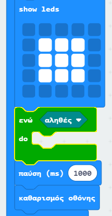
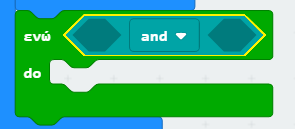
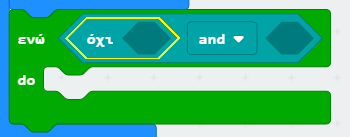
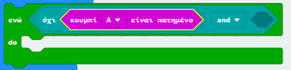
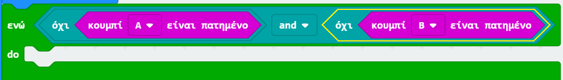
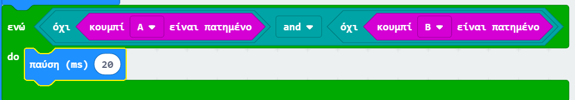

## Αναμονή για νικητή

Ας προσθέσουμε κώδικα για να περιμένουμε μέχρι να πατηθεί ένα κουμπί.

+ Μετά την προβολή μιας εικόνας, θα πρέπει να περιμένετε μέχρι κάποιος να πιέσει το κουμπί.

Ένας άλλος τρόπος διατύπωσης είναι ότι θα χρειαστεί να περιμένετε όσο το κουμπί Α **και** το κουμπί Β **δεν** να (έχει) πατηθεί.

Για να το κάνεις αυτό, πρόσθεσε έναν βρόγχο `ενώ` από την ενότητα «Έλεγχος». Ο βρόγχος `ενώ` πρέπει να προστεθεί αμέσως μετά το μπλοκ `draw`.

+ Σύρε ένα μπλοκ `και` από τη «Λογική» στο μπλοκ `ενώ`:

+ Σύρε ένα `όχι` από τη «Λογική» στην αριστερή πλευρά του `και`:

+ Σύρε το μπλοκ `πλήκτρο Α έχει πιεστεί` από την «Εισαγωγή» σε μετά από το `όχι`:

+ Επανέλαβε τα 2 παραπάνω βήματα για να προσθέσεις το `πλήκτρο Β δεν πατήθηκε` στην `δεξιά` πλευρά του βρόγχου "ενώ".

+ Στη συνέχεια, μπορείς να προσθέσεις μια πολύ σύντομη (20ms) καθυστέρηση, έτσι ώστε ο βρόγχος `ενώ` να περιμένει όσο δεν έχει πατηθεί κάποιο κουμπί.

+ Δοκίμασε το έργο σου. Το παιχνίδι σου θα πρέπει τώρα να εμφανίσει μια εικόνα και στη συνέχεια να περιμένει όσο κουμπιά A **και** B **δεν** έχουν πατηθεί.