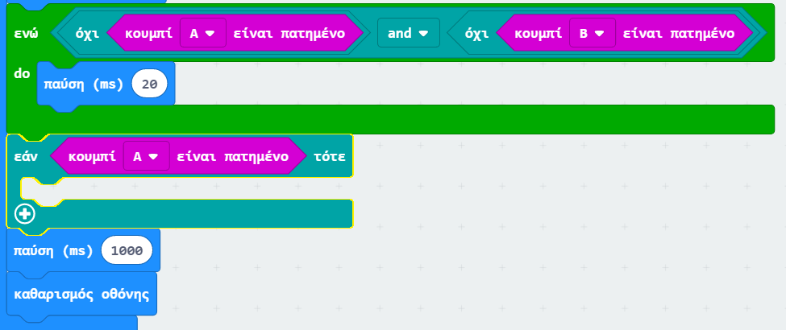
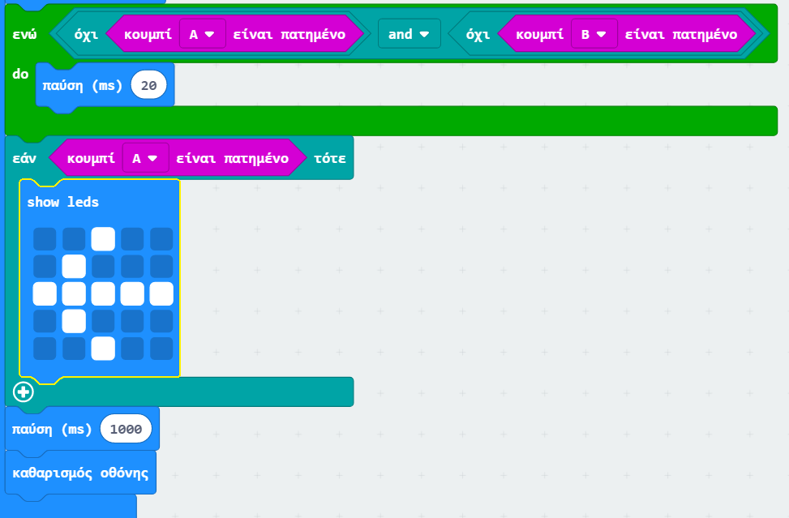
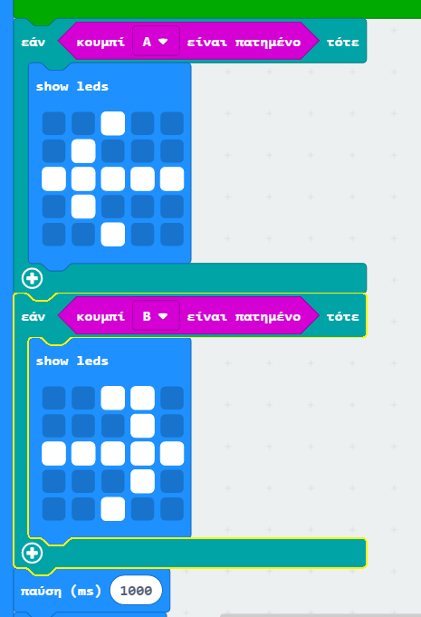

## Who is the faster?

Ας μάθουμε ποιος πίεσε πρώτος το κουμπί του.

+ Εάν πατήθηκε το κουμπί Α, θέλουμε να δείξουμε στον παίκτη Α. Για να το κάνεις αυτό, πρόσθεσε ένα μπλοκ `εάν` μετά το βρόγχο `ενώ`, και αντικατέστησε το `δοκιμή` με `το πλήκτρο A πατήθηκε`.

+ Στη συνέχεια, μπορείς να χρησιμοποιήσεις το μπλοκ `εμφάνιση λυχνιών` για να εμφανίσεις ένα βέλος που δείχνει στον παίκτη Α.

+ Θα πρέπει να κάνεις επίσης το ίδιο για το κουμπί Β.

