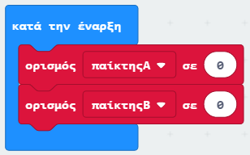

\--- challenge \---

## Πρόκληση: Κράτησε τη βαθμολογία

Μπορείς να χρησιμοποιήσεις δύο μεταβλητές με όνομα `παίκτηςΑ` και `παίκτηςΒ` για να κρατήσεις τη βαθμολογία του κάθε παίκτη;

Θα χρειαστεί να ορίσεις και τις δυο βαθμολογίες στο 0 στην αρχή του παιχνιδιού τοποθετώντας τον κώδικα μέσα στο μπλοκ 'στην έναρξη'.

Και πρόσθεσε 1 σε οποιονδήποτε παίκτη κερδίζει κάθε γύρο.

Θα χρειαστεί επίσης να σκεφτείς έναν τρόπο εμφάνισης της βαθμολογίας.

\--- /challenge \---