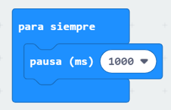
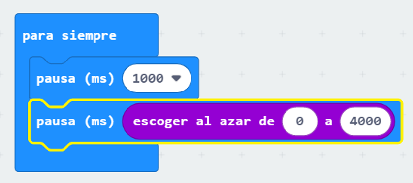
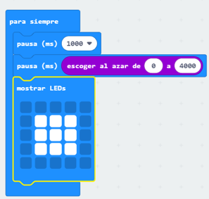
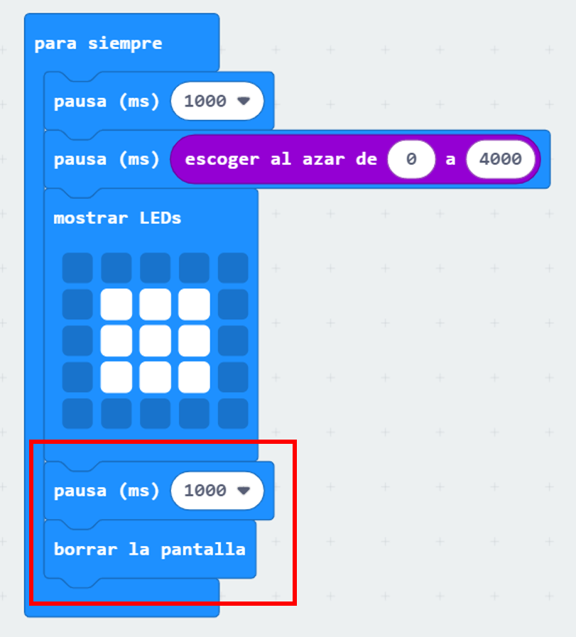

## ¡Espera!

Comencemos mostrando una imagen después de un período de tiempo aleatorio.

+ Ve a <a href="https://rpf.io/microbit-new" target="_blank">rpf.io/microbit-new</a> para comenzar un nuevo proyecto en el editor MakeCode (PXT). Nombra a tu nuevo proyecto "Reacción".

+ Antes de mostrar una imagen, el juego debe esperar por un período de tiempo aleatorio.

Arrastra un bloque de `pausa` en el bloque `siempre` y cambia el tiempo de pausa a 1000 ms:

+ Añade otro bloque de `pausa` y luego arrastra un bloque `número al azar` al bloque `pausa` y establece su valor a 4000:

Recuerda que 1000ms es igual a 1 segundo, así que habrá una pausa de al menos 1 segundo, hasta un máximo de 5 segundos (1000+4000 ms).

Puedes cambiar los números '1000' y '4000' para cambiar la pausa mínima y máxima si así lo deseas.

+ Después de esperar, tu juego debería mostrar una imagen de manera que los jugadores sepan cuándo presionar su botón.

+ Haz click en 'ejecutar' para probar tu proyecto. Deberías ver aparecer tu imagen después de un período de espera aleatorio.

+ Añade código al final del ciclo `por siempre` para mostrar tu imagen por 1 segundo y luego borrar la pantalla.

+ Prueba tu proyecto. Deberías ver tu imagen aparecer al azar y luego desaparecer.