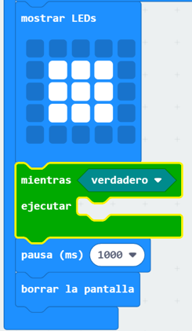
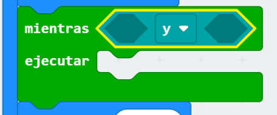
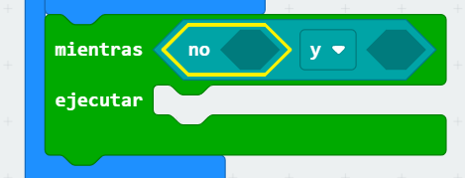
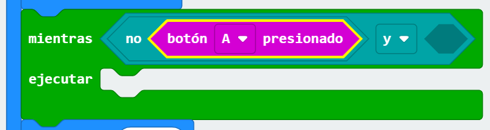
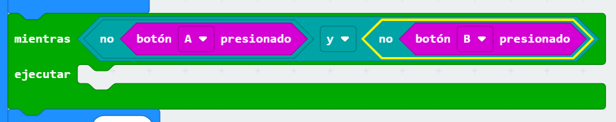
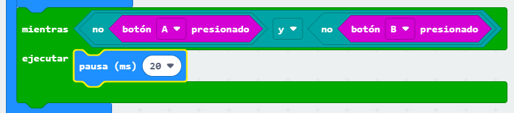

## Espera por un ganador

Agreguemos código para esperar hasta que se presione un botón.

+ Después de mostrar una imagen, deberás esperar hasta que alguien presione su botón.

Otra manera de decir esto es que deberás esperar tanto tiempo como el botón A **y** el botón B **no** hayan sido presionados.

Para hacer esto, agrega el ciclo `mientras` de la sección 'Control'. El ciclo `mientras` debe agregarse justo después del bloque `sorteo`.

+ Arrastra un bloque `y` de 'Lógica' al bloque `mientras`:

+ Arrastra un `no` de 'Lógica' a la mano izquierda de `y`:

+ Arrastra un bloque `al presionarse el botón A` desde 'Entrada' después del `no`:

+ Repite los 2 pasos anteriores para añadir `al no presionarse el botón B` al lado `derecho` del ciclo mientras.

+ Luego, puedes añadir un retraso muy corto (20 ms), para que tu ciclo `mientras` espere mientras no se haya presionado un botón.

+ Prueba tu proyecto. Tu juego ahora debería mostrar una imagen y luego esperar mientras los botones A **y** B **no** hayan sido presionados.