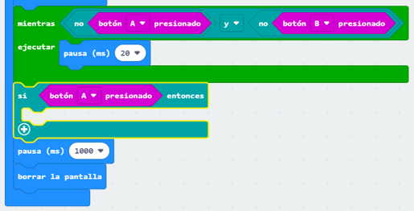
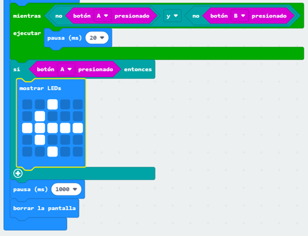
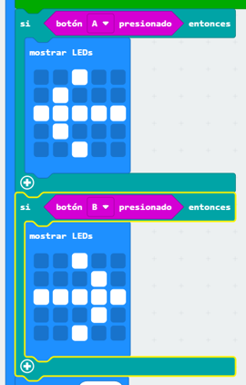

## Who is the faster?

Averigüemos quién presionó su botón primero.

+ Si el botón A fue presionado, queremos apuntar al jugador A. Para hacer esto, añade un bloque `si` después del ciclo `mientras`, y reemplaza `prueba` con `al presionarse el botón A`.

+ Luego puedes utilizar el bloque `mostrar leds` para mostrar una flecha apuntando al jugador A.

+ Debes hacer lo mismo para el botón B, también.

