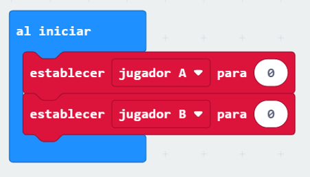

--- challenge ---

## Desafío: Guarda el puntaje

¿Puedes usar dos variables llamadas `jugador A` y `jugador B` para guardar el puntaje de cada jugador?

Tendrás que establecer ambos puntajes a 0 al comienzo del juego colocando el código dentro del bloque 'al inicio'.

Y añade 1 a cualquiera de los jugadores que gane cada ronda.

También deberás pensar en una manera para mostrar el puntaje.

--- /challenge ---

***
Este proyecto fue traducido por voluntarios:

Talía Bonatto

Jorge Paredes

Carlos Miguel Yalta Vargas

Gracias a los voluntarios, podemos dar a las personas de todo el mundo la oportunidad de aprender en su propio idioma. Puedes ayudarnos a llegar a más personas ofreciéndote como voluntario para traducir. Más información en [rpf.io/translate](https://rpf.io/translate).