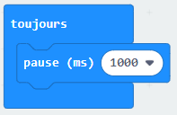
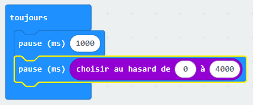
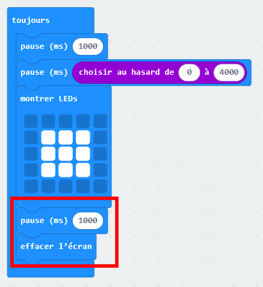

## A vos marques !

Commençons par afficher une image après un délai d'une durée aléatoire.

+ Va sur <a href="https://rpf.io/microbit-new" target="_blank">rpf.io/microbit-new</a> pour démarrer un nouveau projet dans l'éditeur MakeCode (PXT). Appelle ton ouveau projet 'Reaction'.

+ Avant d'afficher une image, le jeu doit attendre pendant une durée aléatoire.

Place un bloc `pause` dans le bloc `toujours` et change la valeur de pause en mettant 1000 ms :

+ Ajoute un autre bloc `pause` et place un bloc `choisir au hasard` dans la valeur du bloc `pause` et mets sa valeur à 4000 :

Souviens-toi que 1000 ms font 1 seconde, donc il y aura une pause d'au moins une seconde et d'un maximum de 5 secondes (1000 + 4000 ms).

Tu peux changer les nombres « 1000 » et « 4000 » pour changer la pause minimale et maximale si tu le souhaites.

+ Après l'attente, le jeu doit montrer une image pour que les joueurs sachent qu'ils doivent appuyer sur leur bouton.

+ Clique sur « lancer » pour tester ton projet. Tu devrais voir apparaître une image après un délai aléatoire.

+ Ajoute du code à la fin de la boucle `toujours` pour afficher ton image pendant 1 seconde puis effacer l'affichage.

+ Teste ton projet. Tu devrais voir ton image apparaître aléatoirement puis disparaître.