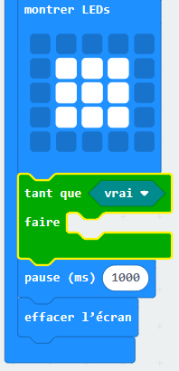
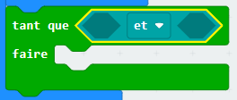
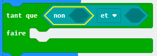
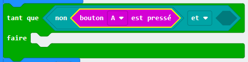
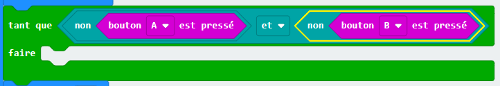
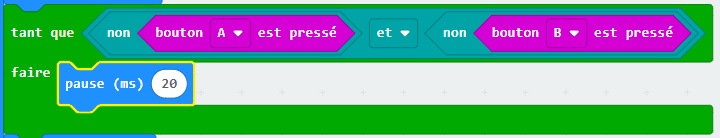

## Attente du gagnant

Ajoute du code pour attendre jusqu'à ce qu'un bouton soit appuyé.

+ Après avoir affiché une image, tu as besoin d'attendre jusqu'à ce que quelqu'un appuie sur son bouton.

Une autre façon de le dire serait que tu dois attendre aussi longtemps que le bouton A **et** le bouton B n'ont **pas** été appuyés.

Pour se faire, ajoute une boucle `tant que` depuis la section « Contrôle ». La boucle `tant que` doit être ajoutée juste après le bloc `montrer LEDs`.

+ Place un `et` à partir du menu « Logique » dans ton bloc `tant que` :

+ Place un `non` à partir du menu « Logique » dans la partie gauche de ton `et` :

+ Place un bloc `bouton A est pressé` à partir du menu « Entrées » après le `non` :

+ Répète les 2 étapes précédentes et ajoute un `non bouton B est pressé` dans la partie `droite` de ta boucle tant que.

+ Tu peux ensuite ajouter un délai très court (20 ms), pour que ta boucle `tant que` attende aussi longtemps qu'un bouton n'est pas appuyé.

+ Teste ton projet. Ton jeu devrait maintenant afficher une image et attendre aussi longtemps que les boutons A **et** B n'ont **pas** été appuyés.