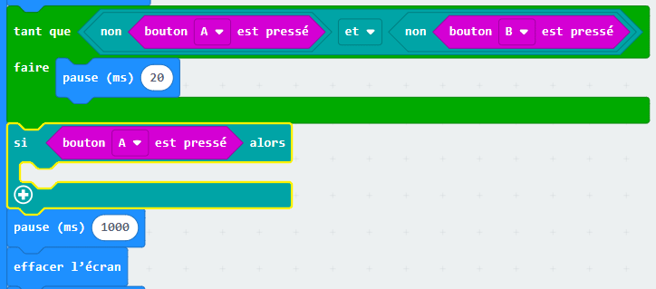
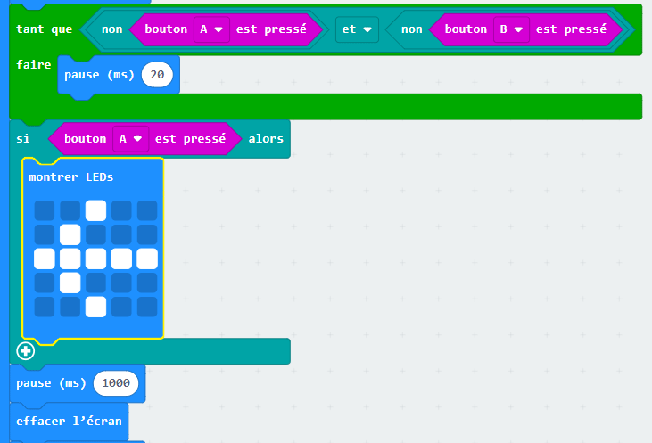
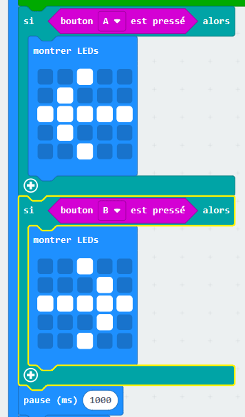

## Qui est le plus rapide ?

Essayons de voir qui a appuyé son bouton en premier.

+ Si le bouton A a été appuyé, nous voulons pointer vers le joueur A. Pour faire cela, ajoute un bloc `si` après ta boucle `tant que`, et remplace `test` par `bouton A est pressé`.

+ Tu peux ensuite utiliser le bloc `montrer LEDs` pour afficher une flèche pointant vers le joueur A.

+ Tu devras également faire la même chose pour le bouton B.

