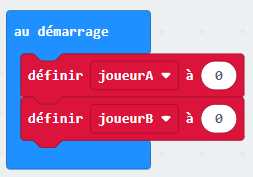

--- challenge ---
## Défi: Conserve le score
Peux tu utiliser deux  variables appellées `joueur1` et `joueurB` pour garder une trace du score de chaque joueur ?

Tu auras besoin de mettre les deux scores à 0 au démarrage du jeu en plaçant ton code dans le bloc 'au démarrage'.

Et ajoute 1 à chaque joueur qui gagne une manche.

Tu devras penser aussi à un moyen d'afficher le score.

--- /challenge ---