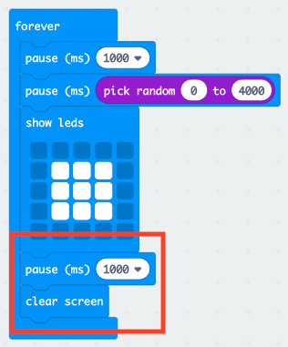

## इसके लिए प्रतीक्षा करें!

आइए यादृच्छिक समय के बाद एक छवि प्रदर्शित करने से शुरू करते हैं।

+ MakeCode (PXT) संपादक में एक नया प्रोजेक्ट शुरू करने के लिए <a href="https://rpf.io/microbit-new" target="_blank">rpf.io/microbit-new</a> पर जाएंँ। अपने नए प्रोजेक्ट को 'प्रतिक्रिया' नाम दें।

+ कोई छवि प्रदर्शित करने से पहले, गेम को यादृच्छिक समय के लिए प्रतीक्षा करनी चाहिए।

`pause` (विराम) ब्लॉक को `forever` (हमेशा के लिए) ब्लॉक में ड्रैग करें और विराम के समय को बदलकर 1000 ms करें:

+ एक और `pause` (विराम) ब्लॉक जोड़ें और फिर `pause` (विराम) ब्लॉक में `pick random` (यादृच्छिक चुनें) ब्लॉक ड्रैग करें और इसका मान 4000 पर सेट करें:

याद रखें कि 1000ms 1 सेकंड होता है, इसलिए कम से कम 1 सेकंड तक से लेकर अधिकतम 5 सेकंड (1000 + 4000 ms) तक का विराम होगा।

यदि आप चाहें तो न्यूनतम और अधिकतम विराम को बदलने के लिए आप '1000' और '4000' संख्याओं को बदल सकते हैं।

+ प्रतीक्षा करने के बाद, आपके गेम को एक छवि दिखानी चाहिए ताकि खिलाड़ियों को पता चल सके कि उन्हें अपना बटन कब दबाना है।

+ अपने प्रोजेक्ट का परीक्षण करने के लिए 'run' (चलाएँ) पर क्लिक करें। यादृच्छिक देरी (random delay) के बाद आपको अपनी छवि दिखाई देनी चाहिए।

+ लूप को अपनी छवि को 1 सेकंड के लिए प्रदर्शित करने और फिर डिस्प्ले को साफ़ करने के लिए `forever` (हमेशा के लिए) लूप के अंत में कोड जोड़ें।

+ अपने प्रोजेक्ट का परीक्षण करें। आपको यह दिखाई देना चाहिए कि आपकी छवि यादृच्छिक रूप से दिखाई देती है और फिर गायब हो जाती है।