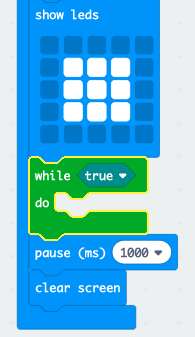
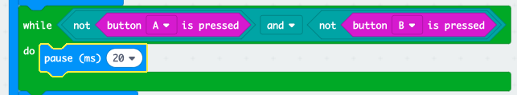

## विजेता की प्रतीक्षा में

आइए बटन दबाए जाने तक प्रतीक्षा करने के लिए कोड जोड़ें।

+ छवि प्रदर्शित होने के बाद, जब तक कोई अपना बटन दबाए तब तक आपको प्रतीक्षा करनी होगी।

इसे कहने का एक और तरीका यह है कि जब तक बटन A **और** बटन B **नहीं** दबाए जाते हैं तब तक आपको प्रतीक्षा करनी होगी।

ऐसा करने के लिए, 'नियंत्रण' (Control) खंड से एक `while` (जबकि) लूप जोड़ें। `while` (जबकि) लूप को `draw` (ड्रॉ) ब्लॉक के ठीक बाद जोड़ा जाना चाहिए।

+ अपने `while` (जबकि) ब्लॉक में 'Logic' ('तर्क') से एक `and` (और) ब्लॉक को ड्रैग करें:

+ 'Logic' ('तर्क') से `and` (और) के बाईं तरफ `not` (नहीं) को ड्रैग करें:

+ `button A is pressed` (बटन A दबा हुआ है) ब्लॉक को 'Input' (इनपुट) से `not` (नहीं) के बाद ड्रैग करें:

+ `not button B is pressed` (बटन B नहीं दबाया गया है) को अपने while लूप के `दाईं` तरफ जोड़ने के लिए ऊपर के 2 चरण दोहराएँ।

+ फिर आप एक बहुत ही कम (20ms) की देरी जोड़ सकते हैं, ताकि जब तक कोई बटन नहीं दबाया जाता है आपका `while` (जबकि) लूप प्रतीक्षा करता है।

+ अपने प्रोजेक्ट का परीक्षण करें। आपके गेम को अब एक छवि प्रदर्शित करनी चाहिए और फिर बटन A **और** B को **नहीं**नहीं> दबाए जाने तक प्रतीक्षा करनी चाहिए।