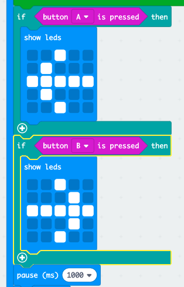

## सबसे तेज़ कौन है?

आइए जानें कि सबसे पहले अपना बटन किसने दबाया था।

+ यदि बटन A दबाया गया था, तो हम खिलाड़ी A को इंगित करना चाहते हैं। ऐसा करने के लिए, अपने `while` (जबकि) लूप के बाद एक `if` (यदि) ब्लॉक जोड़ें, और `test` (परीक्षण) को `button A is pressed` (बटन A दबाया गया है) से बदलें।

+ फिर आप खिलाड़ी A को इंगित करने वाला तीर दिखाने के लिए `show leds` (लेड दिखाएँ) ब्लॉक का उपयोग कर सकते हैं।

+ आपको बटन B के लिए भी ऐसा ही करना चाहिए।

