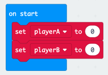

\--- challenge \---

## चुनौती: स्कोर रखें

क्या प्रत्येक खिलाड़ी के स्कोर का ट्रैक रखने के लिए आप `खिलाड़ीA` और `खिलाड़ीB` नाम के दो वेरिएबल का उपयोग कर सकते हैं?

आपको 'on start' (ऑन स्टार्ट) ब्लॉक के अंदर कोड डालकर गेम की शुरूआत में दोनों स्कोर 0 पर सेट करने होंगे।

और जो भी खिलाड़ी प्रत्येक राउंड में जीतता है उसके आगे 1 जोड़ें।

आपको स्कोर प्रदर्शित करने के तरीके के बारे में भी सोचना होगा।

\--- /challenge \---