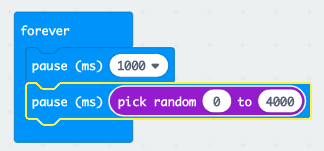

## ಇದಕ್ಕಾಗಿ ಕಾಯಿರಿ!

ರಾಂಡಮ್ ಸಮಯದ ನಂತರ ಚಿತ್ರವನ್ನು ಪ್ರದರ್ಶಿಸುವ ಮೂಲಕ ಆಟವನ್ನು ಪ್ರಾರಂಭಿಸೋಣ.

+ MakeCode (PXT) ಸಂಪಾದಕದಲ್ಲಿ ಹೊಸ ಪ್ರಾಜೆಕ್ಟನ್ನು ಪ್ರಾರಂಭಿಸಲು <a href="https://rpf.io/microbit-new" target="_blank">rpf.io/microbit-new</a>ಗೆ ಹೋಗಿ. ನಿಮ್ಮ ಹೊಸ ಪ್ರಾಜೆಕ್ಟನ್ನು 'Reaction' ಎಂದು ಕರೆಯಿರಿ.

+ ಚಿತ್ರವನ್ನು ಪ್ರದರ್ಶಿಸುವ ಮೊದಲು, ಆಟವು ರಾಂಡಮ್ ಸಮಯಕ್ಕಾಗಿ ಕಾಯಬೇಕು.

`pause` ಅನ್ನು `forever` ನೊಳಗೆ ಎಳೆಯಿರಿ ನಂತರ ವಿರಾಮ ಸಮಯವನ್ನು 1000 ms ‌ಗೆ ಬದಲಾಯಿಸಿ:

+ ಮತ್ತೊಂದು `pause` ಅನ್ನು ಸೇರಿಸಿ ನಂತರ `pick random` ಅನ್ನು ಈಗ ಹಾಕಿದ `pause` ನೊಳಗೆ ಎಳೆಯಿರಿ ಮತ್ತು ಅದರ ಮೌಲ್ಯವನ್ನು 4000 ಗೆ ಹೊಂದಿಸಿ:

1000ms ಅಂದರೆ 1 ಸೆಕೆಂಡ್ ಎಂದು ನೆನಪಿಡಿ, ಆದ್ದರಿಂದ ಕನಿಷ್ಠ 1 ಸೆಕೆಂಡ್‌ನಿಂದ ಗರಿಷ್ಠ 5 ಸೆಕೆಂಡುಗಳವರೆಗೆ (1000 + 4000 ms) ವಿರಾಮ ಇರುತ್ತದೆ.

ನೀವು ಬಯಸಿದರೆ ಕನಿಷ್ಠ ಮತ್ತು ಗರಿಷ್ಠ ವಿರಾಮವನ್ನು ಬದಲಾಯಿಸಲು ನೀವು '1000' ಮತ್ತು '4000' ಸಂಖ್ಯೆಗಳನ್ನು ಬದಲಾಯಿಸಬಹುದು.

+ ವಿರಾಮದ ನಂತರ, ನಿಮ್ಮ ಆಟವು ಒಂದು ಚಿತ್ರವನ್ನು ತೋರಿಸಬೇಕು ಇದರಿಂದ ಆಟಗಾರರು ತಮ್ಮ ಬಟನ್ ನನ್ನು ಯಾವಾಗ ಒತ್ತಬೇಕೆಂದು ತಿಳಿಯುತ್ತದೆ.

+ ನಿಮ್ಮ ಪ್ರಾಜೆಕ್ಟನ್ನು ಪರೀಕ್ಷಿಸಲು 'run' ಕ್ಲಿಕ್ ಮಾಡಿ. ರಾಂಡಮ್ ವಿಳಂಬದ ನಂತರ ನಿಮ್ಮ ಚಿತ್ರ ಕಾಣಿಸಿಕೊಳ್ಳುವುದನ್ನು ನೀವು ವೀಕ್ಷಿಸಬಹುದು.

+ `forever` ನ ಕೊನೆಯಲ್ಲಿ ಕೋಡ್ ಸೇರಿಸಿ ನಿಮ್ಮ ಚಿತ್ರವನ್ನು 1 ಸೆಕೆಂಡಿಗೆ ಪ್ರದರ್ಶಿಸಿ ನಂತರ ಪ್ರದರ್ಶನವನ್ನು ತೆರವುಗೊಳಿಸಿ.

+ ನಿಮ್ಮ ಪ್ರಾಜೆಕ್ಟನ್ನು ಪರೀಕ್ಷಿಸಿ. ನೀವು ನಿಮ್ಮ ಚಿತ್ರವನ್ನು ರಾಂಡಮ್ ಆಗಿ ಗೋಚರಿಸಿ ನಂತರ ಕಣ್ಮರೆಯಾಗುವುದನ್ನು ವೀಕ್ಷಿಸಬಹುದು.