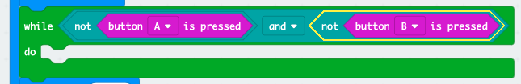

## ವಿಜೇತರಿಗಾಗಿ ಕಾಯಲಾಗುತ್ತಿದೆ

ಬಟನ್'ನನ್ನು ಒತ್ತುವವರೆಗೂ ಕಾಯಲು ಕೋಡ್ ಅನ್ನು ಸೇರಿಸೋಣ.

+ ಚಿತ್ರವನ್ನು ಪ್ರದರ್ಶಿಸಿದ ನಂತರ, ಯಾರಾದರೂ ತಮ್ಮ ಬಟನ್'ನನ್ನು ಒತ್ತುವವರೆಗೂ ನೀವು ಕಾಯಬೇಕಾಗುತ್ತದೆ.

ಇದನ್ನು ಹೇಳುವ ಇನ್ನೊಂದು ವಿಧಾನವೆಂದರೆ ನೀವು ಬಟನ್ A ಅಥವಾ ಬಟನ್ B ಒತ್ತುವವರೆಗೆ ಕಾಯಬೇಕಾಗುತ್ತದೆ (**and**, **not**).

ಇದನ್ನು ಮಾಡಲು, 'Control' ವಿಭಾಗದಿಂದ `while` ಅನ್ನು ಸೇರಿಸಿ. `draw` ಆದ ನಂತರ `while` ಅನ್ನು ಸೇರಿಸಬೇಕು.

+ 'Logic' ಇಂದ ಒಂದು `and` ಬ್ಲಾಕ್ ಅನ್ನು ನಿಮ್ಮ `while` ಬ್ಲಾಕ್ ಒಳಗೆ ಇಳಿಸಿರಿ:

+ 'Logic' ಇಂದ ಒಂದು `not` ಅನ್ನು `and` ನ ಎಡಗಡೆ ಇಳಿಸಿರಿ:

+ 'Input' ಇಂದ ಒಂದು `button A is pressed` ಅನ್ನು `not` ನ ನಂತರ ಇಳಿಸಿರಿ:

+ `not button B is pressed` ಅನ್ನು while ನ `ಬಲಕ್ಕೆ` ಕೂಡಿಸಲು ಮೇಲಿನ 2 ಹಂತಗಳನ್ನು ಪುನರಾವರ್ತಿಸಿ.

+ ನಂತರ ನೀವು ಪುಟ್ಟ ವಿಳಂಬವನ್ನು (20ms) ಸೇರಿಸಬಹುದು, ಇದರಿಂದಾಗಿ ನಿಮ್ಮ `while` ಲೂಪ್ ಬಟನ್'ನನ್ನು ಒತ್ತುವವರೆಗೆ ಕಾಯುತ್ತದೆ.

+ ನಿಮ್ಮ ಪ್ರಾಜೆಕ್ಟನ್ನು ಪರೀಕ್ಷಿಸಿ. ನಿಮ್ಮ ಆಟವು ಈಗ ಚಿತ್ರವನ್ನು ಪ್ರದರ್ಶಿಸಬೇಕು ಮತ್ತು ಬಟನ್ A ಅಥವಾ ಬಟನ್ B ಒತ್ತುವವರೆಗೆ ಕಾಯಬೇಬೇಕು (**and**, **not**).