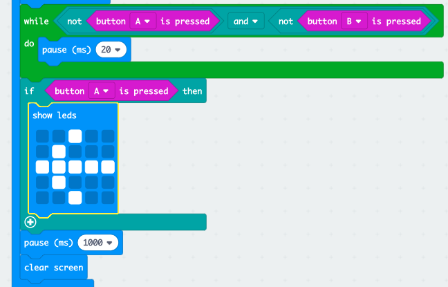

## Who is the faster?

ಮೊದಲು ಅವರ ಬಟನ್ನನ್ನು ಯಾರು ಒತ್ತಿದ್ದಾರೆಂದು ನೋಡೋಣ.

+ A ಬಟನ್ನನ್ನು ಮೊದಲು ಒತ್ತಿದ್ದರೆ, ನಾವು ಪ್ಲೇಯರ್ A ಯನ್ನು ಸೂಚಿಸಬೇಕು. ಇದನ್ನು ಮಾಡಲು, `if` ಅನ್ನು `while` ನ ನಂತರ ಸೇರಿಸಿ ಮತ್ತು `test` ಅನ್ನು `button A is pressed` ನಿಂದ ಬದಲಾಯಿಸಿ.

+ ನಂತರ ನೀವು `show leds` ಸಹಾಯದಿಂದ ಬಾಣವನ್ನು ಪ್ಲೇಯರ್ A ಕಡೆಗೆ ಸೂಚಿಸಿ.

+ ಬಟನ್ B ಗಾಗಿ ನೀವು ಇದೇ ರೀತಿ ಮಾಡಬೇಕು.

