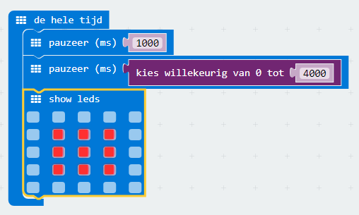

## Wacht!

Laten we beginnen met het weergeven van een afbeelding na een willekeurige hoeveelheid tijd.

+ Ga naar <a href="https://rpf.io/microbit-new" target="_blank">rpf.io/microbit-new</a> om een ​​nieuw project te starten in de MakeCode (PXT) editor. Noem je nieuwe project 'Reactie'.

+ Voordat een afbeelding wordt weergegeven, moet het spel een willekeurige hoeveelheid tijd wachten.

Sleep een blok van `pauzeer` in het blok van `de hele tijd` en verander de pauze in 1000 ms:

+ Voeg nog een `pauzeer` blok toe en sleep daarin een `kies willekeurige van 0 tot` blok en zet de waarde op 4000:

Onthoud dat 1000ms 1 seconde is, dus er zal een pauze zijn van minstens 1 seconde tot een maximum van 5 seconden (1000 + 4000 ms).

Je kunt de cijfers '1000' en '4000' wijzigen om de minimale en maximale pauze te wijzigen als je dat wilt.

+ Na het wachten moet je spel een afbeelding laten zien zodat spelers weten wanneer ze op hun knop moeten drukken.

+ Klik op 'Start de simulator' om je project te testen. Je zou je afbeelding na een willekeurige vertraging moeten zien verschijnen.

+ Voeg code toe aan het einde van de `de hele tijd` lus om je afbeelding gedurende 1 seconde weer te geven en wis vervolgens het scherm.

+ Test je project. Je zou je afbeelding willekeurig moeten zien verschijnen en verdwijnen.