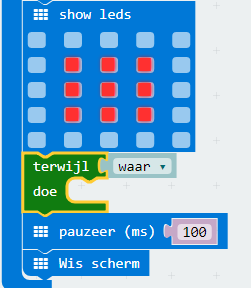
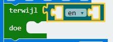
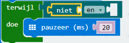
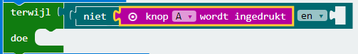
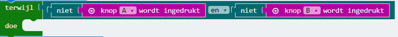
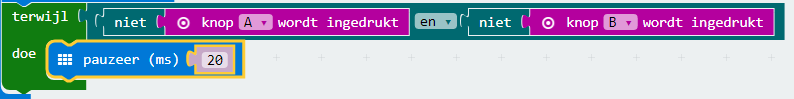

## Wachten op een winnaar

Laten we code toevoegen om te wachten tot er op een knop wordt gedrukt.

+ Nadat je een afbeelding hebt weergegeven, moet je wachten totdat iemand op de knop drukt.

Een andere manier om dit te zeggen, is dat je moet wachten zolang knop A **en** knop B **niet** zijn ingedrukt.

Voeg hiervoor een `terwijl` lus in het gedeelte 'Besturing'. De `terwijl` lus moet worden toegevoegd net na het blok `show leds`.

+ Sleep een `en` blok van 'Logisch' naar je `terwijl` blok:

+ Sleep een `niet` vanuit 'Logisch' naar de linkerkant van het `en` blok:

+ Sleep een `knop A wordt ingedrukt` blok van 'Invoer' naar na het `niet` blok:

+ Herhaal de 2 bovenstaande stappen om een `niet knop B wordt ingedrukt` in de `rechter` zijde van je terwijl lus te plaatsen.

+ Je kunt dan een zeer korte (20 ms) vertraging toevoegen, zodat je `terwijl` lus wacht zolang er niet op een knop wordt gedrukt.

+ Test je project. Je game zou nu een afbeelding moeten weergeven en vervolgens moeten wachten zolang er niet op een van de knoppen A **of** B **** wordt gedrukt.