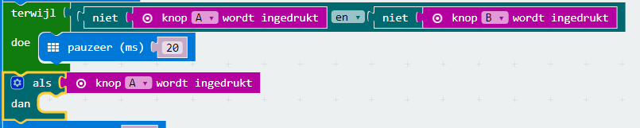
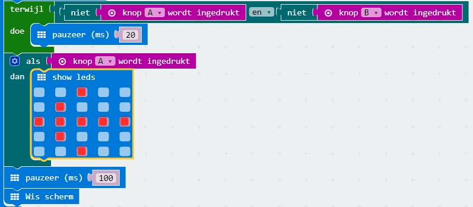
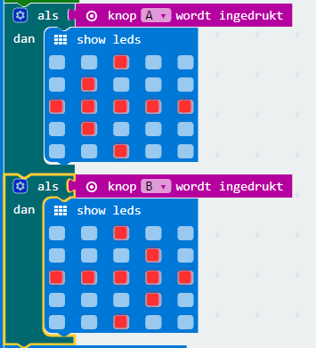

## Who is the faster?

Laten we uitzoeken wie er het eerst op zijn knop heeft gedrukt.

+ Als knop A werd ingedrukt, willen we wijzen naar speler A. Voeg hiervoor een `als` blok na je `terwijl` lus toe en vervang `waar` door `knop A wordt ingedrukt`.

+ Je kunt dan gebruik maken van het `show leds` blok met een pijl die wijst naar speler A.

+ Je zou hetzelfde moeten doen voor knop B.

