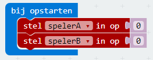

--- challenge ---

## Uitdaging: score bijhouden

Kun je twee variabelen genaamd `spelerA` en `spelerB` maken om de score van elke speler bij te houden?

Je moet beide scores instellen op 0 aan het begin van het spel door code te plaatsen in het blok 'bij opstarten'.

En voeg 1 toe aan elke speler die een ronde wint.

Je moet ook een manier bedenken om de score weer te geven.

--- /challenge ---

***

Dit project werd vertaald door vrijwilligers:

Cor Groot

Max Schaaper

Dankzij vrijwilligers kunnen we mensen over de hele wereld de kans geven om in hun eigen taal te leren. Jij kunt ons helpen meer mensen te bereiken door vrijwillig te starten met vertalen - meer informatie op [rpf.io/translate](https://rpf.io/translate).