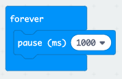

## Czekaj na to!

Zacznijmy od wyświetlania obrazu po losowym odstępie czasu.

+ Przejdź do <a href="https://rpf.io/microbit-new" target="_blank">rpf.io/microbit-new</a>, aby rozpocząć nowy projekt w edytorze MakeCode (PXT). Nazwij swój nowy projekt „Refleks”.

+ Przed wyświetleniem obrazu gra powinna odczekać losowy okres czasu.

Przeciągnij blok `pause` do bloku `forever` i zmień czas wstrzymania na 1000 ms:

+ Dodaj kolejny blok `pause` a następnie przeciągnij blok `pick random` do bloku `pause` i ustaw jego wartość na 4000:

Pamiętaj, że 1000 ms to 1 sekunda, więc przerwa wyniesie co najmniej jedną sekundę a maksymalnie pięć sekund (1000 + 4000 ms).

Jeżeli chcesz, możesz zmienić liczby „1000” i „4000”, aby zmienić minimalną i maksymalną długość pauzy.

+ Po odczekaniu gra powinna wyświetlić obraz, aby gracze wiedzieli, kiedy nacisnąć przycisk.

+ Kliknij 'run', aby przetestować swój projekt. Powinieneś zobaczyć, jak twój obraz pojawi się z losowym opóźnieniem.

+ Dodaj kod na końcu pętli `forever`, aby wyświetlić obraz przez 1 sekundę, a następnie wyczyść ekran.

+ Przetestuj swój projekt. Powinieneś zobaczyć, jak obraz pojawia się losowo, a następnie znika.