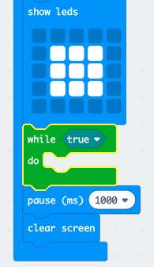
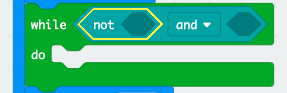

## Oczekiwanie na zwycięzcę

Dodajmy kod, aby poczekać aż przycisk zostanie wciśnięty.

+ Po wyświetleniu obrazu, musisz poczekać aż ktoś naciśnie przycisk.

Innym sposobem powiedzenia tego jest to, że musisz poczekać tak długo, jak przycisk A **i** przycisk B **nie** został wciśnięty.

Aby to zrobić, dodaj pętlę `while` z sekcji "Control". Pętla `while` powinna zostać dodana tuż po bloku `draw`.

+ Przeciągnij blok `and` z sekcji 'Logic' do twojego bloku `while`:

+ Przeciągnij `not` z 'Logic' na lewą stronę bloku `and`:

+ Przeciągnij blok `button A is pressed` z sekcji 'Input' i umieść go za blokiem `not`:

+ Powtórz dwa powyższe kroki, aby dodać `not button B is pressed` z `prawej` strony twojej pętli "while".

+ Następnie możesz dodać bardzo krótkie (20 ms) opóźnienie, aby Twoja pętla `while` czekała, dopóki przycisk nie zostanie naciśnięty.

+ Przetestuj swój projekt. Twoja gra powinna teraz wyświetlać obraz, a następnie czekać tak długo, jak przyciski A **i** B **nie** zostały wciśnięte.