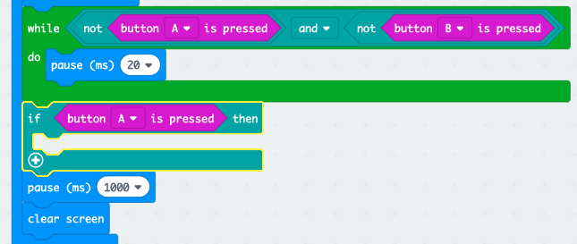
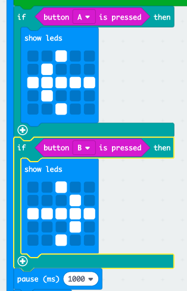

## Kto jest najszybszy?

Dowiedzmy się, kto pierwszy nacisnął przycisk.

+ Jeśli przycisk A został wciśnięty, chcemy wskazać na gracza A. Aby to zrobić, dodaj blok `if` po twojej pętli `while` i zamień `true` na `button A is pressed`.

+ Następnie możesz użyć bloku `show leds` aby pokazać strzałkę skierowaną do gracza A.

+ Powinnaś zrobić to samo dla przycisku B.

