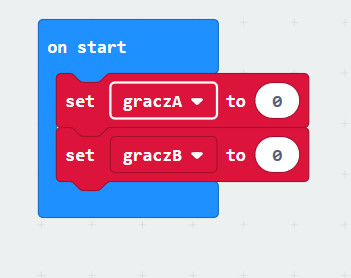

--- challenge ---

## Wyzwanie: zachowaj wynik

Czy możesz użyć dwóch zmiennych o nazwach `graczA` i `graczB` aby śledzić wyniki każdego gracza?

Na początku gry musisz ustawić oba wyniki na 0, umieszczając kod w bloku „on start”.

I dodaj 1 dla gracza, który wygra każdą z rund.

Musisz również pomyśleć o sposobie wyświetlania wyniku.

--- /challenge ---

***
Ten projekt został przetłumaczony przez wolontariuszy:

Tomasz Przybyłek

Krzysztof Nowak

Dzięki wolontariuszom możemy dać ludziom na całym świecie szansę nauki w ich własnym języku. Możesz pomóc nam dotrzeć do większej liczby osób, zgłaszając się na ochotnika do tłumaczenia - więcej informacji na stronie [rpf.io/translate](https://rpf.io/translate).