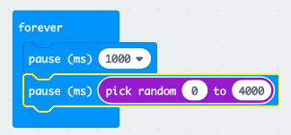

## Pe locuri!

Să începem prin afișarea unei imagini după o perioadă aleatorie de timp.

+ Mergi la <a href="https://rpf.io/microbit-new" target="_blank">rpf.io/microbit-new</a> pentru a începe un proiect nou în editorul MakeCode (PXT). Numește noul tău proiect „Reflexe”.

+ Înainte de a afișa o imagine, jocul ar trebui să aștepte o perioadă aleatorie de timp.

Trage un bloc `pause` în blocul `forever` și modifică timpul de pauză la 1000 ms:

+ Adaugă un alt bloc `pause` și trage apoi un bloc `pick random` în blocul de `pause` și setează-i valoarea la 4000:

Amintește-ți că 1000ms este 1 secundă, deci va exista o pauză de cel puțin 1 secundă până la maximum 5 secunde (1000 + 4000 ms).

Poți schimba numerele „1000” și „4000” pentru a schimba pauza minimă și maximă dacă dorești.

+ După așteptare, jocul tău ar trebui să afișeze o imagine, astfel încât jucătorii să știe când să apese butonul.

+ Codul tău ar trebui sa fie executat automat. Ar trebui să vezi imaginea ta după o întârziere aleatorie.

+ Adaugă cod la sfârșitul buclei `forever` pentru a afișa imaginea ta timp de 1 secundă, apoi șterge afișajul.

+ Testează proiectul. Ar trebui să vezi că imaginea ta apare la un moment aleatoriu și apoi dispare.