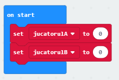

--- challenge ---

## Provocare: Ține scorul

Poți folosi două variabile numite `JucatorA` și `JucatorB` pentru a ține evidența scorului fiecărui jucător?

Va trebui să setezi ambele scoruri la 0 la începutul jocului adăugând cod în blocul „on start”.

Și adaugă 1 la oricare dintre jucătorii care câștigă fiecare rundă.

Va fi nevoie să te gândești și la o modalitate de a afișa scorul.

--- /challenge ---

**Traducere realizată de comunitate**

Proiectul a fost tradus de **Catalina Toderita** și verificat de **Gelu Ungur**.

Traducătorii noștri voluntari ne ajută să oferim copiilor din întreaga lume șansa de a învăța să programeze. Ne poți ajuta să ajungem la mai mulți copii, ajutând la traducerea proiectelor noastre – află mai multe pe rpf.io/translators.