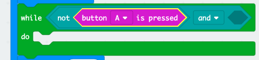
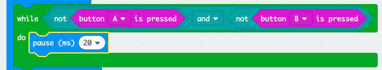

## Waiting for a winner

Let's add code to wait until a button is pressed.

+ After displaying an image, you'll need to wait until someone presses their button.

Another way of saying this is that you'll need to wait as long as button A **and** button B have **not** been pressed.

To do this, add a `while` loop from the 'Control' section. The `while` loop should be added in just after the `draw` block.

+ Drag an `and` block from 'Logic' to your `while` block:

+ Drag a `not` from 'Logic' into the left hand side of the `and`:

+ Drag an `button A is pressed` block from 'Input' to after the `not`:

+ Repeat the 2 steps above to add `not button B is pressed` into the `right` side of your while loop.

+ You can then add a very short (20ms) delay, so that your `while` loop waits as long as a button hasn't been pressed.

+ Test your project. Your game should now display an image and then wait as long as buttons A **and** B have **not** been pressed.